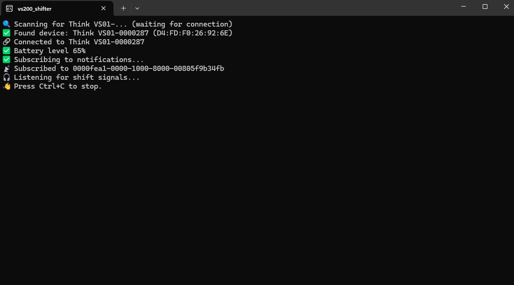

#  🚴‍♂️ vs200_switch
A small Python script that turns the Thinkrider VS200 bluetooth controller into a working virtual shifter for MyWhoosh (or Rouvy).
The idea and most of the code are stolen from:
https://github.com/dxd7/CYCPLUS-BC2-Virtual-Shifter

I removed all the debouncing code as it doesn't seem necessary (notifications from the thinkrider vs200 seem to be filtered by the controller itself).

## ⚙️ Requirements

You’ll need: python 3.9+ and the following python packages: bleak and pyautogui

Just "pip install bleak pyautogui".
You may need to use "python -m pip" or "py -m pip" instead of just "pip" depending on your python installation.

## 🚀 How to Use
Wake up the controller (just press any key) and run the script.
All that it does is emulating keypresses: "k" "i" for mywhoosh or "+" "-" for rouvy.
After some initialzation put it in background and run mywhoosh.

For rouvy use "rouvy" as a command line argument.

Below is the original README from https://github.com/dxd7/CYCPLUS-BC2-Virtual-Shifter :

## 🚴‍♂️ BC2 Virtual Shifter Bridge

A small Python script that turns the CYCPLUS BC2 Bluetooth controller into a working virtual shifter for MyWhoosh.

It connects to the BC2 over Bluetooth, listens for the upshift and downshift buttons, and sends keyboard presses which match MyWhoosh’s built-in virtual shifting controls.

Perfect for setups like a Saris H3 or any trainer that doesn’t have built-in shifting.

## 🧩 Features

Maps upshift → k, downshift → i (MyWhoosh defaults)

## ⚙️ Requirements

You’ll need:

Python 3.9+

A Bluetooth Low Energy (BLE) adapter

The following Python packages:

pip install bleak pyautogui

## 🚀 How to Use

Run the script:

python bc2_virtual_shifter.py

Wake Up/Reset Shifter: Hold both the UP (+) and DOWN (-) buttons simultaneously for about 5 seconds.

Wait for Confirmation: The script will automatically connect. Wait for the success messages:  
(If it fails to connect the first time and the script just closes, run it again and it should work)

🔍 Scanning for BC2... (waiting for connection)  
✅ Found device: CYCPLUS BC2 ...  
🔗 Connected  
🎧 Listening for shift signals...  

Start Riding: Open MyWhoosh (or your preferred app).

## 💡 Notes 

Tested on Windows 11 with Python 3.13.9 and MyWhoosh using a Saris H3.

## 🧠 Background

I bought the BC2 thinking it would just work for virtual shifting in MyWhoosh with my Saris H3 — turns out, it didn’t.
After a lot of trial and error (and some help from ChatGPT and Gemini), I wrote this little script to make it all work properly.

Nothing fancy, but it does exactly what I needed — so I’m sharing it in case it helps someone else.
